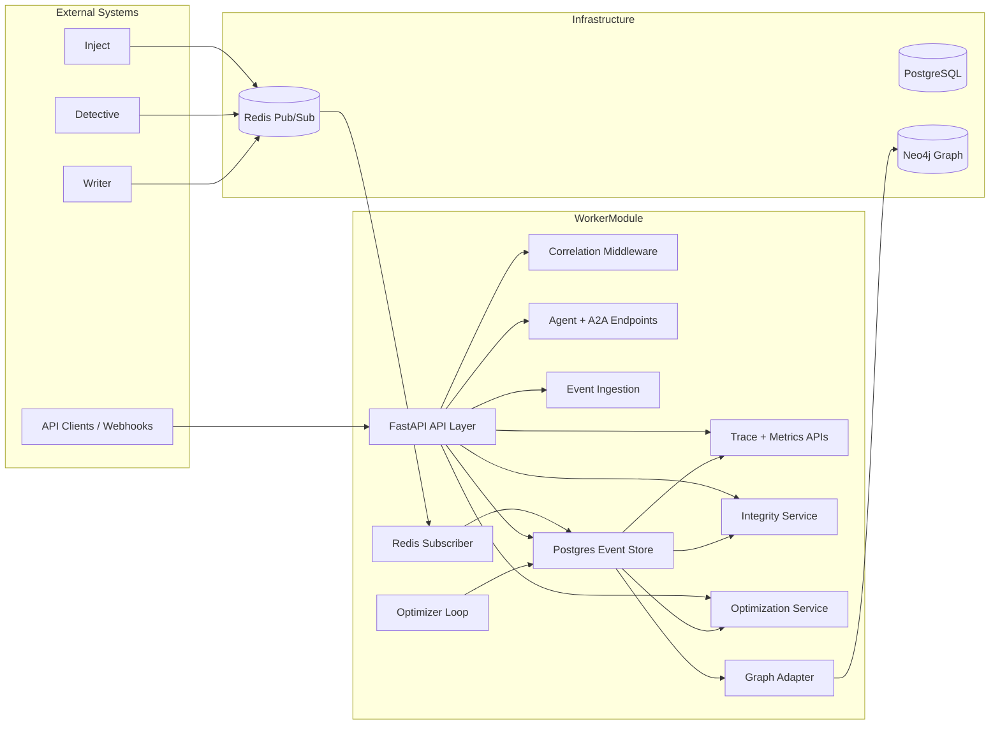
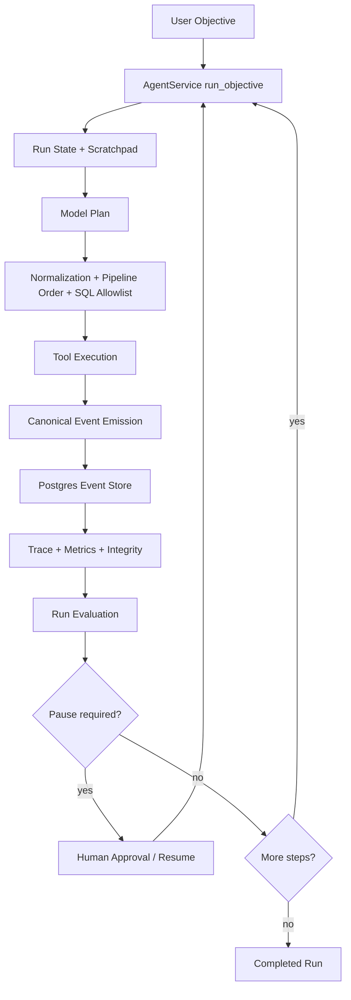

# WorkerModule Architecture

WorkerModule is the observability, traceability, integrity, and optimization backbone for the AgenticOutbound system. It does not generate leads or execute campaigns; instead, it records the system of record for events and outcomes, reconstructs end-to-end traces, and exposes the operational control plane that keeps the pipeline measurable and safe.

## Architecture at a Glance

## Design Principles

The codebase is organized around a small number of stable principles:

1. PostgreSQL is the system of record for all canonical events, outcomes, alerts, recommendations, and config state.
2. Redis is the transport for asynchronous event publication and background ingestion.
3. Neo4j is an optional projection layer for graph-based trace inspection.
4. Correlation IDs are preserved across HTTP requests, events, and background tasks so a single business flow can be reconstructed end to end.
5. Optimization remains bounded and policy-driven. The worker can recommend or apply controlled changes, but it cannot silently mutate the outbound pipeline.

## Main Runtime Layers

### 1. API Composition Root

The application starts in [app/main.py](../app/main.py). That file wires the FastAPI app, CORS, correlation middleware, routers, shared database state, the graph adapter, the agent service, the Redis subscriber, and the optimizer background loop.

This is the only place where the application assembles its runtime dependencies. Keeping those concerns in one location makes the system easier to reason about and safer to deploy.

### 2. HTTP and A2A Control Plane

The API layer exposes the operational interface for the worker:

- Health and readiness endpoints for deployment checks.
- Event ingestion and trace retrieval endpoints.
- Integrity, KPI, and optimization endpoints.
- Agent runtime endpoints for runs, evaluation, resume, and tool discovery.
- A2A endpoints for inter-agent command exchange.

The control plane is intentionally thin. Most endpoints validate input, call the relevant service, and return a structured response.

### 3. Event Plane

Events enter WorkerModule through two paths:

- Direct HTTP ingestion.
- Redis pub/sub via the background subscriber.

Both paths converge on the same canonical event envelope and persistence layer. That gives the system replayability, idempotency, and a single audit trail regardless of how the event arrived.

Canonical event fields:

- event_id
- correlation_id
- module
- event_type
- timestamp
- payload
- metadata

### 4. Storage and Projection Layer

PostgreSQL stores the durable application state:

- events
- outcomes
- integrity alerts
- graph sync checkpoints
- optimization recommendations
- global config

The graph adapter projects event and outcome data into Neo4j when the graph backend is available. If Neo4j is unavailable, the service degrades gracefully and keeps the canonical data in Postgres.

### 5. Background Services

WorkerModule runs two long-lived background tasks:

- Redis subscriber: listens for canonical event envelopes and persists them without an HTTP round-trip.
- Optimizer loop: periodically scans recent feedback events and adjusts bounded configuration values when policy conditions are met.

These tasks keep the system responsive while still providing autonomous ingestion and feedback handling.

## Request and Data Flow

### Ingestion Flow

1. A client or upstream module submits an event or calls the orchestration API.
2. The correlation middleware ensures the request carries a stable correlation ID.
3. The event is validated and written to PostgreSQL.
4. The event is optionally published to Redis for downstream consumers.
5. Trace, KPI, integrity, and graph views read from the same canonical store.

### Traceability Flow

1. Events and outcomes are persisted with correlation IDs.
2. Integrity checks detect missing events, orphaned outcomes, duplicate patterns, and sequence gaps.
3. Graph projection builds nodes and edges for correlation, event, lead, and outcome relationships.
4. Trace endpoints can reconstruct the workflow from either Postgres or Neo4j depending on availability.

### Optimization Flow

1. Telemetry and feedback are collected in Postgres.
2. KPI and optimization helpers compute deterministic recommendations.
3. Policy checks prevent unbounded or unauthorized changes.
4. Approved changes are written back to the global configuration and broadcast when needed.

## AI Agentic Architecture

WorkerModule also hosts an agent runtime that behaves like a bounded, auditable control loop rather than a free-form chatbot.

The agent runtime is intentionally constrained:

- Tool use is normalized before execution.
- Event generation follows a fixed pipeline order.
- SQL access is restricted to an explicit allowlist.
- Certain milestones pause for human approval.
- Each run is evaluated after execution, and the evaluation is persisted with the run state.

The main agent tools are:

- generate_and_ingest_event for canonical event creation and persistence.
- sql_query for allowlisted database reads.
- search_knowledge for semantic lookup over Worker domain knowledge.
- fetch_company_intelligence for graph-backed enrichment.
- search_web for external enrichment when permitted.

This makes the agent useful without giving it unrestricted control over the worker or the outbound pipeline.

## Feedback Loop

The feedback loop in WorkerModule has two layers that reinforce each other.

### 1. Agent Execution Feedback Loop

1. The user or upstream system provides an objective.
2. The agent plans a bounded step using the current state and available tools.
3. The worker validates and executes the action.
4. Events and tool results are written to the run state and event store.
5. The run is evaluated for relevance, accuracy, and completeness.
6. If the run pauses, a human approves the next step and the loop resumes.
7. If the run completes, the final evaluation becomes part of the audit trail.

### 2. System Optimization Feedback Loop

1. Feedback events arrive through HTTP or Redis.
2. The optimizer loop inspects recent feedback signals.
3. KPI helpers and optimization helpers compute bounded recommendations.
4. Policy checks decide whether a recommendation can be proposed or applied.
5. Approved changes update global configuration and can be broadcast to downstream consumers.

Together, these loops create a system that learns from execution without allowing uncontrolled self-modification.

## Key Modules and Responsibilities

### app/main.py

Composition root for the service. It initializes middleware, routers, the database pool, the graph adapter, the agent service, and the background workers.

### app/modules/worker/storage.py

Durable persistence layer for events, outcomes, integrity alerts, checkpoints, recommendations, and configuration. This is the primary storage boundary of the system.

### app/subscriber.py

Redis consumer that receives event envelopes from upstream modules and persists them directly into Postgres.

### app/modules/worker/graph.py

Transforms relational event and outcome records into graph nodes and edges for trace reconstruction.

### app/adapters/graph.py

Neo4j adapter used for graph persistence and trace queries. Designed to fail gracefully when the graph backend is unavailable.

### app/modules/worker/integrity.py

Detects structural problems in event chains, including duplicates, missing events, and orphaned outcomes.

### app/modules/worker/kpi.py

Computes reply rate, conversion rate, and aggregate event distributions.

### app/modules/worker/optimization.py

Builds dry-run recommendations and enforces policy constraints for any apply-mode changes.

### app/modules/agent/service.py

Agent runtime and tool orchestration layer. It coordinates bounded model-driven behavior, SQL allowlists, and persistent run state.

## Operational Guarantees

The architecture is designed to provide the following guarantees:

- Correlation continuity across HTTP, Redis, and background processing.
- Idempotent event persistence based on event_id.
- Safe degradation when Redis, Neo4j, or external A2A services are unavailable.
- Auditability through append-friendly event, outcome, alert, and recommendation records.
- Controlled optimization through allowlists and bounded percentage changes.

## Integration Boundaries

WorkerModule consumes data from upstream modules but does not own their business logic.

- Inject owns lead collection and enrichment.
- Detective owns lead scoring and relationship intelligence.
- Writer owns outreach generation and execution.
- Worker owns telemetry, traceability, integrity, and optimization.

That separation keeps WorkerModule focused on system health and decision quality rather than campaign execution.

## Deployment View

The service is intended to run as a containerized FastAPI application with the following dependencies:

- PostgreSQL for durable state.
- Redis for pub/sub event transport.
- Optional Neo4j for graph trace projection.
- Optional external A2A services for Detective and Writer.

The application can start even when the graph backend is temporarily unavailable, which reduces operational fragility.

## Why This Architecture Is Valuable

This design creates value in three ways:

1. It makes every important business action traceable from input to outcome.
2. It gives operators a reliable way to inspect failures, gaps, and performance shifts.
3. It enables bounded optimization without allowing uncontrolled automation to mutate the outbound pipeline.

In practice, that means the Worker module is not just a logger. It is the trust layer for the broader AgenticOutbound system.
